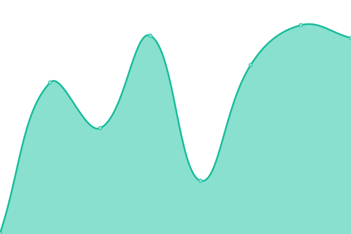
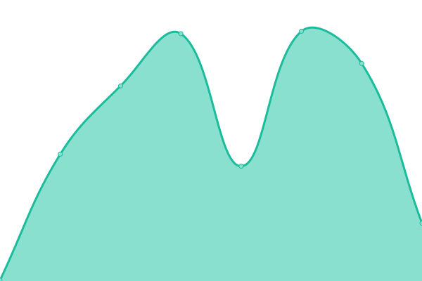
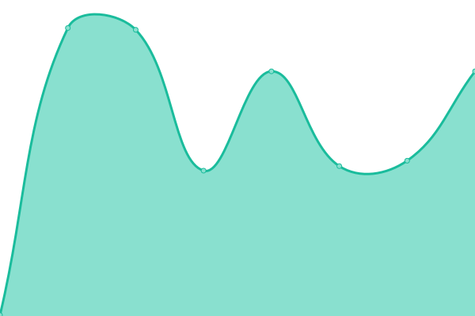

# [📈 Live Status](https://status.condorbs.net): <!--live status--> **🟩 Todos los sistemas funcionan correctamente**

This repository contains the open-source uptime monitor and status page for [TheSL18](https://status.condorbs.net), powered by [Upptime](https://github.com/upptime/upptime).

With [Upptime](https://upptime.js.org), you can get your own unlimited and free uptime monitor and status page, powered entirely by a GitHub repository. We use [Issues](https://github.com/TheSL18/upptime/issues) as incident reports, [Actions](https://github.com/TheSL18/upptime/actions) as uptime monitors, and [Pages](https://status.condorbs.net) for the status page.

<!--start: status pages-->
<!-- This summary is generated by Upptime (https://github.com/upptime/upptime) -->
<!-- Do not edit this manually, your changes will be overwritten -->
<!-- prettier-ignore -->
| URL | Status | History | Response Time | Uptime |
| --- | ------ | ------- | ------------- | ------ |
|  API Listas Negras Globalists | 🟩 Activo | [api-listas-negras-globalists.yml](https://github.com/TheSL18/upptime/commits/HEAD/history/api-listas-negras-globalists.yml) | 

 221ms
     
 | 

<a href="https://status.condorbs.net/history/api-listas-negras-globalists">98.28%</a>
    

|  API Login Globalists | 🟩 Activo | [api-login-globalists.yml](https://github.com/TheSL18/upptime/commits/HEAD/history/api-login-globalists.yml) | 

 247ms
     
 | 

<a href="https://status.condorbs.net/history/api-login-globalists">98.29%</a>
    

|  API S3 Condor | 🟩 Activo | [api-s3-condor.yml](https://github.com/TheSL18/upptime/commits/HEAD/history/api-s3-condor.yml) | 

 204ms
     
 | 

<a href="https://status.condorbs.net/history/api-s3-condor">98.29%</a>
    

|  S3 Condor | 🟩 Activo | [s3-condor.yml](https://github.com/TheSL18/upptime/commits/HEAD/history/s3-condor.yml) | 

 209ms
     
 | 

<a href="https://status.condorbs.net/history/s3-condor">98.30%</a>
    

|  Servicios Globalists | 🟩 Activo | [servicios-globalists.yml](https://github.com/TheSL18/upptime/commits/HEAD/history/servicios-globalists.yml) | 

 202ms
     
 | 

<a href="https://status.condorbs.net/history/servicios-globalists">98.30%</a>
    

|  CBSLN | 🟩 Activo | [cbsln.yml](https://github.com/TheSL18/upptime/commits/HEAD/history/cbsln.yml) | 

 210ms
     
 | 

<a href="https://status.condorbs.net/history/cbsln">100.00%</a>
    

|  CBSIP | 🟩 Activo | [cbsip.yml](https://github.com/TheSL18/upptime/commits/HEAD/history/cbsip.yml) | 

 183ms
     
 | 

<a href="https://status.condorbs.net/history/cbsip">100.00%</a>
    

|  CBS WEB | 🟩 Activo | [cbs-web.yml](https://github.com/TheSL18/upptime/commits/HEAD/history/cbs-web.yml) | 

 216ms
     
 | 

<a href="https://status.condorbs.net/history/cbs-web">99.89%</a>
    

|  CBS AMERICA | 🟩 Activo | [cbs-america.yml](https://github.com/TheSL18/upptime/commits/HEAD/history/cbs-america.yml) | 

 220ms
     
 | 

<a href="https://status.condorbs.net/history/cbs-america">99.88%</a>
    

<!--end: status pages-->

[**Visit our status website →**](https://status.condorbs.net)

## 📄 License

- Powered by: [Upptime](https://github.com/upptime/upptime)
- Code: [MIT](./LICENSE) © [Anand Chowdhary](https://anandchowdhary.com), supported by [Pabio](https://pabio.com)
- Data in the `./history` directory: [Open Database License](https://opendatacommons.org/licenses/odbl/1-0/)
